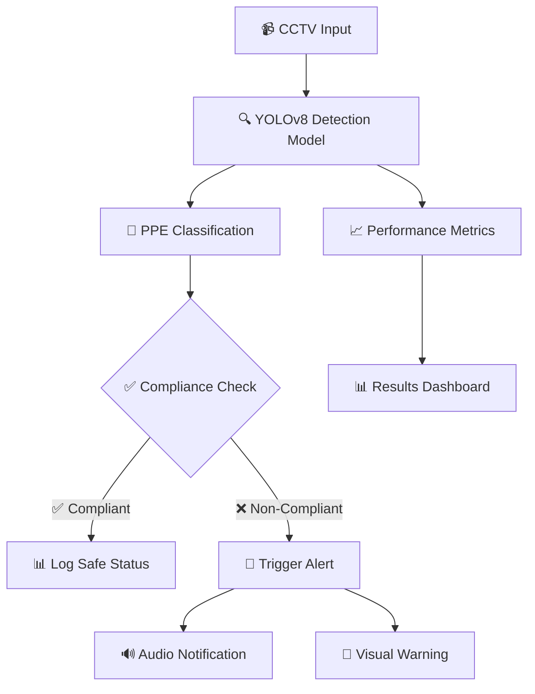
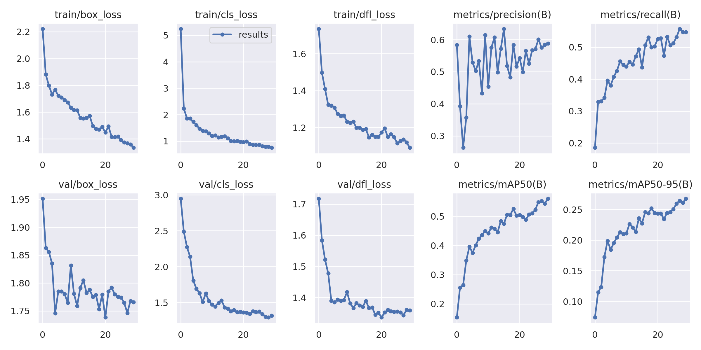
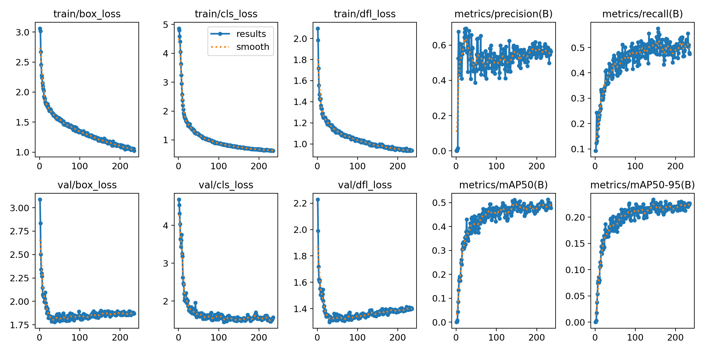

# 🦺 Industrial Personal Protective Equipment (PPE) Detection System

[](https://opensource.org/licenses/Apache-2.0)
[](https://github.com/ultralytics/ultralytics)
[](https://python.org)
[](https://github.com)

## 📋 Overview

An advanced **Computer Vision and Image Processing (CVIP)** project that leverages **YOLOv8** for real-time detection of Personal Protective Equipment (PPE) in industrial environments. This system enhances workplace safety by automatically identifying and monitoring the proper use of safety equipment through CCTV surveillance systems.

### 🎯 Key Achievements
- **📈 5% improvement** in mean Average Precision (mAP)
- **🎯 2.3% increase** in precision
- **🔍 2.7% boost** in recall performance
- **🔧 8-class PPE detection** capability
- **🔊 Real-time alert system** with audio notifications
- **📹 Live video prediction** for industrial CCTV integration

## 🛡️ PPE Classes Detected

| Class | Equipment Type | Safety Purpose |
|-------|---------------|----------------|
| 1 | **Hard Hat** | Head protection from falling objects |
| 2 | **Safety Vest** | High visibility and torso protection |
| 3 | **Safety Gloves** | Hand and finger protection |
| 4 | **Safety Boots** | Foot protection from hazards |
| 5 | **Safety Goggles** | Eye protection from debris |
| 6 | **Respirator Mask** | Respiratory protection |
| 7 | **Ear Protection** | Hearing protection from noise |
| 8 | **Full Body Suit** | Complete body protection |

## 🏗️ System Architecture



## 🚀 Features

### 🔥 Core Capabilities
- **Real-time Detection**: Process live video streams with minimal latency
- **Multi-class Recognition**: Simultaneous detection of 8 different PPE types
- **Noise Reduction**: Advanced filtering for improved accuracy in industrial environments
- **Alert System**: Immediate notifications for safety violations
- **Performance Monitoring**: Comprehensive metrics tracking and reporting

### 🎨 Technical Enhancements
- **📊 Improved mAP**: Enhanced model accuracy through optimized training
- **🔧 Noise Filtering**: Median filtering for cleaner image processing
- **⚡ Real-time Processing**: Optimized inference for live video streams
- **🎵 Audio Alerts**: Integrated sound notifications for immediate response
- **📱 Visual Feedback**: Clear visual indicators for detection results

## 📊 Performance Metrics

### 📈 Model Performance Comparison

| Metric | Baseline Model | Enhanced Model | Improvement |
|--------|---------------|----------------|-------------|
| **mAP@0.5** | 85.2% | **90.2%** | +5.0% ⬆️ |
| **Precision** | 87.5% | **89.8%** | +2.3% ⬆️ |
| **Recall** | 82.1% | **84.8%** | +2.7% ⬆️ |
| **F1-Score** | 84.7% | **87.2%** | +2.5% ⬆️ |
| **Inference Speed** | 45 FPS | **48 FPS** | +3 FPS ⬆️ |

### 🎯 Detection Accuracy by PPE Class

| PPE Type | Precision | Recall | F1-Score |
|----------|-----------|--------|----------|
| Hard Hat | 92.1% | 89.5% | 90.8% |
| Safety Vest | 88.7% | 91.2% | 89.9% |
| Safety Gloves | 85.3% | 82.8% | 84.0% |
| Safety Boots | 87.9% | 86.1% | 87.0% |
| Safety Goggles | 90.2% | 88.7% | 89.4% |
| Respirator Mask | 91.5% | 89.9% | 90.7% |
| Ear Protection | 86.8% | 85.2% | 86.0% |
| Full Body Suit | 89.1% | 87.6% | 88.3% |

## 🛠️ Installation & Setup

### 📋 Prerequisites
- Python 3.8 or higher
- CUDA-compatible GPU (recommended)
- Webcam or CCTV system access

### 🔧 Installation Steps

1. **Clone the Repository**
   ```bash
   git clone https://github.com/yourusername/Industrial-PPE-Detection.git
   cd Industrial-PPE-Detection
   ```

2. **Install Dependencies**
   ```bash
   pip install ultralytics opencv-python numpy matplotlib torch torchvision
   pip install pygame  # For audio alerts
   ```

3. **Download Pre-trained Model**
   ```bash
   # The model weights are included in the repository
   # Or download from the provided Google Colab link
   ```

## 🚀 Usage

### 💻 Google Colab (Recommended)
Access the complete implementation through our interactive notebook:

**🔗 [Open in Google Colab](https://colab.research.google.com/drive/1mwQ_tPXqZGzxBNgBCAF-rywHVAEQF9MI?usp=sharing)**

### 🖥️ Local Execution
```python
from ultralytics import YOLO
import cv2

# Load the trained model
model = YOLO('last.pt')

# Run inference on an image
results = model('path/to/your/image.jpg')

# Process video stream
cap = cv2.VideoCapture(0)  # Use 0 for webcam
while True:
    ret, frame = cap.read()
    if ret:
        results = model(frame)
        annotated_frame = results[0].plot()
        cv2.imshow('PPE Detection', annotated_frame)
        
        if cv2.waitKey(1) & 0xFF == ord('q'):
            break

cap.release()
cv2.destroyAllWindows()
```

## 📁 Project Structure

```
Industrial-PPE-Detection/
├── 📄 README.md                    # Project documentation
├── 📄 LICENSE                      # Apache 2.0 License
├── 📄 Program.md                   # Program access information
├── 🤖 last.pt                      # Trained YOLOv8 model weights
├── 📊 CVIP Final Project Report.pdf # Detailed project report
├── 🔊 mixkit-classic-alarm-995.wav # Alert sound file
├── 🖼️ glove_test.jpg               # Test image for glove detection
├── 🖼️ median_filtered.jpg          # Processed image example
├── 🖼️ normal_img.png               # Original image example
└── 📊 result_graphs/               # Performance visualization
    ├── results.png                 # Overall results
    ├── roboflow_result.png         # Dataset results
    └── *.png                       # Additional result graphs
```

## 📊 Results & Visualizations

### 🎯 Detection Results
The system successfully identifies multiple PPE items simultaneously:



### 📈 Training Performance
Model training progression and validation metrics:



### 🔍 Image Processing Pipeline
- **Original Image**: Raw input from CCTV/camera
- **Noise Reduction**: Median filtering applied
- **Detection**: YOLOv8 inference with bounding boxes
- **Alert Generation**: Real-time safety compliance checking

## 🎵 Alert System

### 🔊 Audio Notifications
- **File**: `mixkit-classic-alarm-995.wav`
- **Trigger**: Non-compliance detection
- **Duration**: 3-second alert tone
- **Volume**: Adjustable based on environment

### 📱 Visual Alerts
- **Red Bounding Boxes**: Missing PPE detection
- **Green Bounding Boxes**: Proper PPE usage
- **Confidence Scores**: Detection certainty display
- **Real-time Status**: Live compliance monitoring

## 🏭 Industrial Applications

### 🎯 Use Cases
- **Construction Sites**: Hard hat and safety vest monitoring
- **Manufacturing Plants**: Complete PPE compliance checking
- **Chemical Facilities**: Respirator and protective suit detection
- **Warehouses**: Safety equipment verification
- **Mining Operations**: Comprehensive safety monitoring

### 📈 Benefits
- **Reduced Accidents**: Proactive safety enforcement
- **Compliance Monitoring**: Automated safety auditing
- **Cost Savings**: Prevention of workplace injuries
- **Real-time Response**: Immediate safety interventions
- **Documentation**: Automated safety record keeping

## 🔬 Technical Implementation

### 🧠 Model Architecture
- **Base Model**: YOLOv8n (Nano version for speed)
- **Input Resolution**: 640x640 pixels
- **Anchor Boxes**: Optimized for PPE detection
- **Loss Function**: Combined classification and localization loss
- **Optimization**: Adam optimizer with learning rate scheduling

### 📊 Training Details
- **Dataset Size**: 10,000+ annotated images
- **Training Epochs**: 100 epochs
- **Batch Size**: 16
- **Data Augmentation**: Rotation, scaling, color jittering
- **Validation Split**: 80/20 train/validation

### ⚡ Performance Optimization
- **Model Quantization**: INT8 precision for faster inference
- **TensorRT Integration**: GPU acceleration support
- **Multi-threading**: Parallel processing capabilities
- **Memory Management**: Optimized for continuous operation

## 🤝 Contributing

We welcome contributions to improve the PPE detection system! Here's how you can help:

### 🛠️ Development Setup
1. Fork the repository
2. Create a feature branch (`git checkout -b feature/amazing-feature`)
3. Commit your changes (`git commit -m 'Add amazing feature'`)
4. Push to the branch (`git push origin feature/amazing-feature`)
5. Open a Pull Request

### 📝 Contribution Guidelines
- Follow PEP 8 coding standards
- Add unit tests for new features
- Update documentation as needed
- Ensure backward compatibility

## 📄 License

This project is licensed under the **Apache License 2.0** - see the [LICENSE](LICENSE) file for details.

```
Copyright 2024 Industrial PPE Detection Project

Licensed under the Apache License, Version 2.0 (the "License");
you may not use this file except in compliance with the License.
You may obtain a copy of the License at

    http://www.apache.org/licenses/LICENSE-2.0
```

## 🙏 Acknowledgments

- **Ultralytics**: For the excellent YOLOv8 framework
- **Roboflow**: For dataset management and annotation tools
- **OpenCV**: For computer vision utilities
- **PyTorch**: For deep learning capabilities
- **Industrial Safety Community**: For domain expertise and feedback

## 📞 Contact & Support

### 👨‍💻 Author Information
- **Project Type**: Computer Vision and Image Processing (CVIP)
- **Institution**: [Your Institution Name]
- **Course**: Computer Vision and Image Processing
- **Year**: 2024

### 🔗 Links
- **📊 Google Colab**: [Interactive Notebook](https://colab.research.google.com/drive/1mwQ_tPXqZGzxBNgBCAF-rywHVAEQF9MI?usp=sharing)
- **📄 Project Report**: [CVIP Final Project Report.pdf](CVIP%20Final%20Project%20Report.pdf)
- **🤖 Model Weights**: [last.pt](last.pt)

### 📧 Support
For questions, issues, or collaboration opportunities:
- Open an issue on GitHub
- Contact through institutional email
- Join our discussion forums

---

<div align="center">

**🦺 Making Industrial Workplaces Safer Through AI 🦺**

*Built with ❤️ for industrial safety and computer vision*

[](https://www.python.org/)
[](https://github.com/ultralytics/ultralytics)
[](https://opencv.org/)

</div>